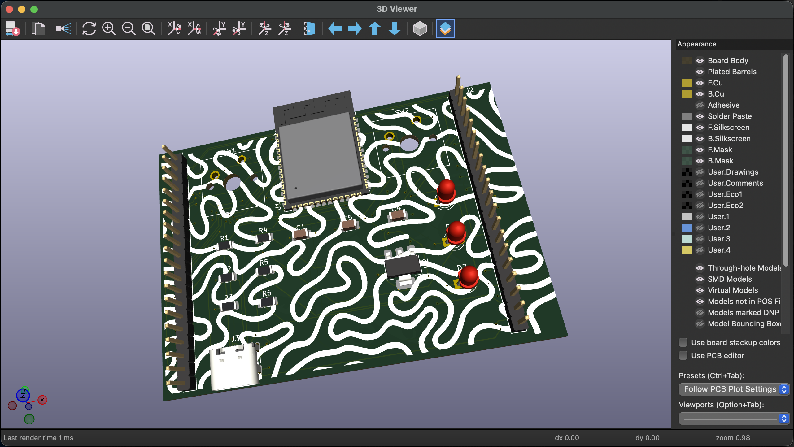
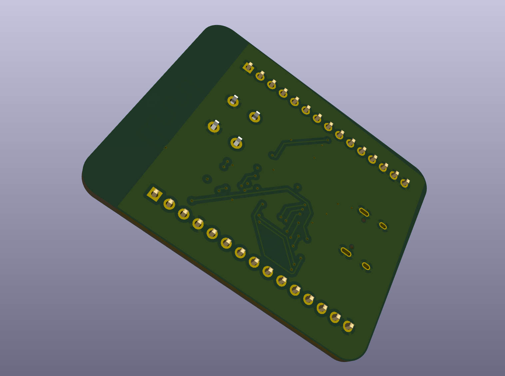
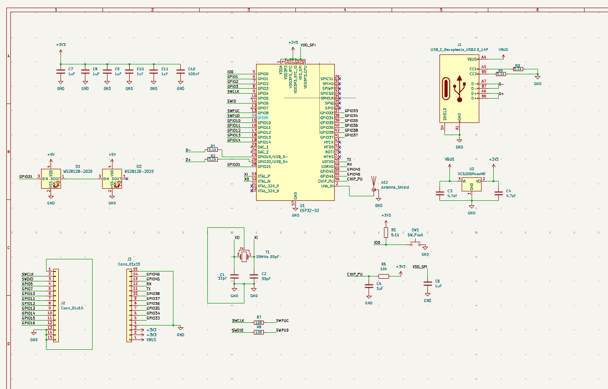
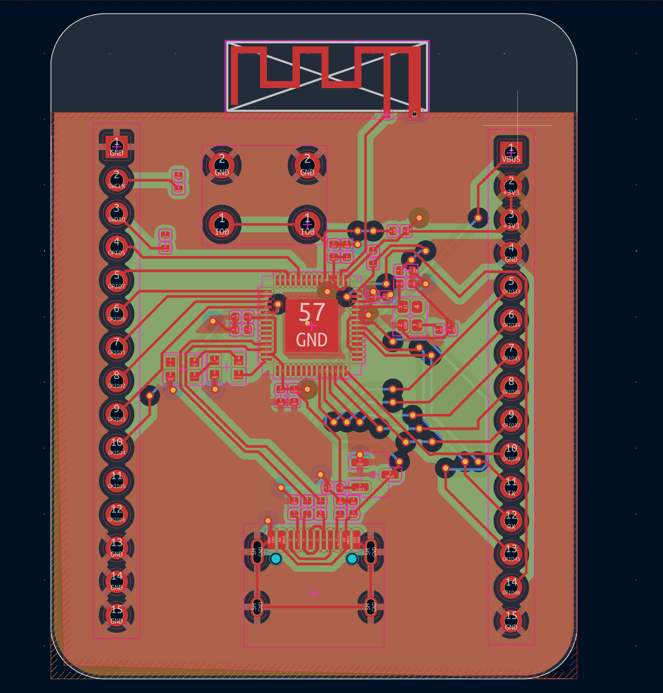

# ESP32-S2 Development Board

Development board built using Espressif ESP32-S2FH4 with USB-C, two WS2812B LEDs, 3.3V LDO and GPIO headers, which have 15 pins on both sides.

## Reasons for creating this project

I created this board because I want to get experience in designing a PCB and build my own ESP32 board. I was interested in building the schematic, routing the PCB and putting everything together.

### How it works

The board receives 5V from USB-C port and uses 3.3V LDO to power the ESP32-S2 module.
The ESP32-S2 is the core part of the board and can be programmed through USB-C.
GPIO pins are routed to two 1x15 headers to use them with jumper wires and breadboard.
WS2812B LEDs and a button were used to add some functionality to the board.

### 3D Model

### Schematics & Routing

## BOM Summary

| Qty | Component                  | Selected Part                             | Supplier                  | Link                                                            | MOQ | Unit Price (USD) | Order Cost (USD) |
| --: | -------------------------- | ----------------------------------------- | ------------------------- | --------------------------------------------------------------- | --: | ---------------: | ---------------: |
|   1 | 25 MHz Crystal, 20 pF      | SJK 7F25000E20UCG                         | SJK                       | [C252274](https://www.lcsc.com/product-detail/C252274.html)     |   5 |          $0.1139 |            $0.57 |
|   2 | 33 pF Capacitor            | FOJAN FCC0402N330J500AT                   | FOJAN                     | [C5137486](https://www.lcsc.com/product-detail/C5137486.html)   | 100 |          $0.0030 |            $0.30 |
|   1 | 100 nF Capacitor           | Samsung Electro-Mechanics CL05B104KO5NNNC | Samsung Electro-Mechanics | [C1525](https://www.lcsc.com/product-detail/C1525.html)         | 100 |          $0.0046 |            $0.46 |
|   7 | 1 µF Capacitor             | Samsung Electro-Mechanics CL05A105KA5NQNC | Samsung Electro-Mechanics | [C52923](https://www.lcsc.com/product-detail/C52923.html)       |  50 |          $0.0100 |            $0.50 |
|   2 | 4.7 µF Capacitor           | Samsung Electro-Mechanics CL05A475MP5NRNC | Samsung Electro-Mechanics | [C23733](https://www.lcsc.com/product-detail/C23733.html)       |  50 |          $0.0167 |            $0.84 |
|   2 | WS2812B-2020 LED           | XINGLIGHT XL-2020RGBC-2812B               | XINGLIGHT                 | [C5349955](https://www.lcsc.com/product-detail/C5349955.html)   |   5 |          $0.1112 |            $0.56 |
|   1 | 1 A / 12 V Resettable Fuse | R+O SMD0805-100-12                        | R+O                       | [C46640991](https://www.lcsc.com/product-detail/C46640991.html) |  10 |          $0.0435 |            $0.44 |
|   1 | USB-C Receptacle           | SHOU HAN TYPE-C16PIN                      | SHOU HAN                  | [C393939](https://www.lcsc.com/product-detail/C393939.html)     |  10 |          $0.0592 |            $0.59 |
|   5 | 5.1 kΩ Resistor            | UNI-ROYAL 0402WGF5101TCE                  | UNI-ROYAL                 | [C25905](https://www.lcsc.com/product-detail/C25905.html)       | 100 |          $0.0023 |            $0.23 |
|   3 | 10 kΩ Resistor             | UNI-ROYAL 0402WGF1002TCE                  | UNI-ROYAL                 | [C25744](https://www.lcsc.com/product-detail/C25744.html)       | 100 |          $0.0034 |            $0.34 |
|   1 | Tactile Push Button        | XUNPU TS-1088-AR02016                     | XUNPU                     | [C720477](https://www.lcsc.com/product-detail/C720477.html)     |  10 |          $0.0516 |            $0.52 |
|   1 | ESP32-S2FH4                | ESPRESSIF ESP32-S2FH4                     | ESPRESSIF                 | [C2840995](https://www.lcsc.com/product-detail/C2840995.html)   |   1 |          $2.4574 |            $2.46 |
|   1 | 3.3 V LDO                  | TOREX XC6206P332MR-G                      | TOREX                     | [C5446](https://www.lcsc.com/product-detail/C5446.html)         |   5 |          $0.1437 |            $0.72 |

## Total

** BOM Total: $8.53 USD**

## Parts

| Designator                 | Part                |
| -------------------------- | ------------------- |
| C1, C2                     | 33 pF               |
| C3, C4, C5, C6, C7, C8, C9 | 1 µF                |
| C10                        | 100 nF              |
| C39, C40                   | 4.7 µF              |
| D1, D2                     | WS2812B-2020        |
| F1                         | Resettable Fuse     |
| J1                         | USB-C Receptacle    |
| R1, R2, R3, R4, R5         | 5.1 kΩ              |
| R6, R7, R8                 | 10 kΩ               |
| SW1                        | Tactile Push Button |
| U1                         | ESP32-S2FH4         |
| U2                         | XC6206P332MR-G      |
| Y1                         | 25 MHz Crystal      |

