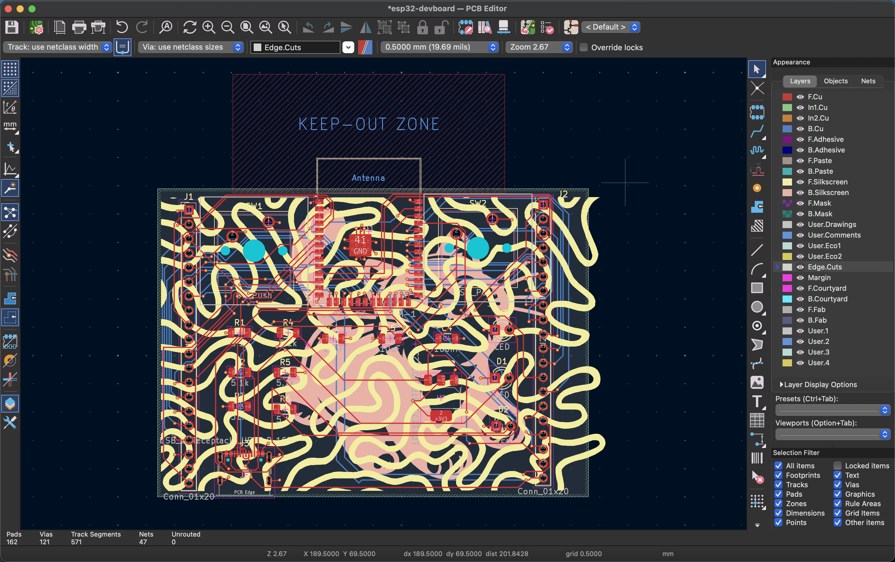

# ESP32-S3 Development Board

Custom designed development board made using an Espressif ESP32-S3-WROOM-1 module. This board provides USB-C connectivity to the computer, breakout headers for prototyping, and tactile switches. This board was designed and created for the sole purpose of learning the process used to design a Printed Circuit Board (PCB)

## Why this project
This project was created as a means to learn how to design hardware PCBs. Instead of using a pre-existing dev board, creating my own board allowed me to understand how microcontroller boards are routed for power (LDO regulators), and how USB and GPIO signals are routed for custom PCBs.

### How does it work
1. The board uses a USB-C to provide 5V to the system. A 5V to 3.3V LDO regulator (LD1117S33TR) is used to ensure a stable voltage is applied to the ESP32 and the board's logic.
2. The ESP32-S3-WROOM-1 is used to provide the main processing functions, such as Wi-Fi and Bluetooth communication protocols.
3. The board also breaks out all available GPIO pins to two 1x20 pin headers for prototyping and breadboarding purposes. The two tactile switches are connected to separate GPIO pins so that they can be used as momentary push-buttons.

### 3D Renders

### Schematics & Routing

#### Components Summary
Component Totals

**Physical Components** 19
**Resistors** 6
**Capacitors** 3
**LEDs** 3
**20-Pin Headers** 2
**Push-Buttons** 2
**USB-C** 1
**Voltage Regulator** 1
**ESP32-S3** 1

#### Bill of Materials (BOM)

## Bill of Materials (BOM)

| Reference | Qty | Value | Footprint / Description | Supplier Link |
| :--- | :---: | :--- | :--- | :--- |
| **C1, C5** | 2 | 10uF | Capacitor_SMD:C_1206_3216Metric | [LCSC C13585](https://www.lcsc.com/product-detail/C13585.html) |
| **C4** | 1 | 100nF | Capacitor_SMD:C_1206_3216Metric | [LCSC C1748](https://www.lcsc.com/product-detail/C1748.html) |
| **D1, D2, D3** | 3 | LED | LED_THT:LED_D3.0mm | [LCSC C72041](https://www.lcsc.com/product-detail/C72041.html) |
| **J1, J2** | 2 | Conn_01x20 | Connector_PinHeader_2.54mm:PinHeader_1x20_P2.54mm_Vertical | [LCSC C2337](https://www.lcsc.com/product-detail/C2337.html) |
| **J3** | 1 | USB_C_Receptacle_USB2.0_16P | Connector_USB:USB_C_Receptacle_GCT_USB4105-xx-A_16P_TopMnt_Horizontal | [LCSC C2765186](https://www.lcsc.com/product-detail/C2765186.html) |
| **R1, R2, R4, R5, R6**| 5 | 5.1k | Resistor_SMD:R_1206_3216Metric | [LCSC C17936](https://www.lcsc.com/product-detail/C17936.html) |
| **R3** | 1 | 51.k | Resistor_SMD:R_1206_3216Metric | [LCSC C17942](https://www.lcsc.com/product-detail/C17942.html) |
| **SW1, SW2** | 2 | SW_Push | Button_Switch_Keyboard:SW_Cherry_MX_1.00u_PCB | [StacksKB Link](https://stackskb.com/store/cherry-mx-clear-switch-5-pin-pack-of-10/) |
| **U1** | 1 | ESP32-S3-WROOM-1 | RF_Module:ESP32-S3-WROOM-1 | [LCSC C2913202](https://www.lcsc.com/product-detail/C2913202.html) |
| **U2** | 1 | LD1117S33TR_SOT223 | Package_TO_SOT_SMD:SOT-223-3_TabPin2 | [LCSC C86781](https://www.lcsc.com/product-detail/C86781.html) |